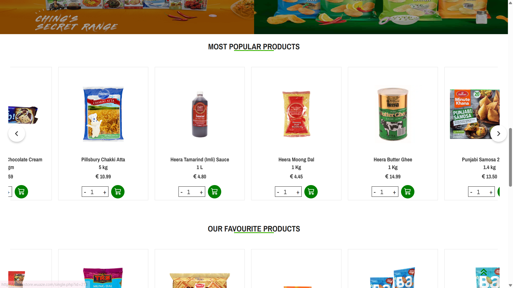
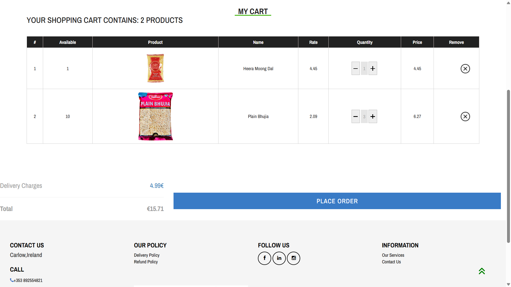
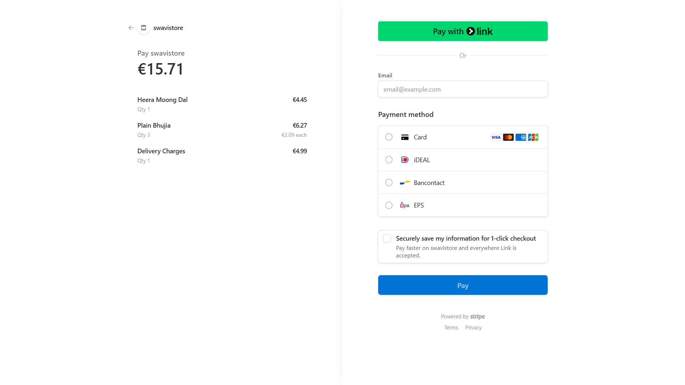

 # 🛒 Swavi Grocery Store

**Swavi Grocery Store** is a full-featured, responsive e-commerce platform for browsing and purchasing groceries. Built with HTML, CSS, JavaScript, PHP, and MySQL, it includes user authentication, shopping cart functionality, and payment integration.

🌐 **Live Demo:** [https://swavistore.wuaze.com](https://swavistore.wuaze.com)

---

## 🚀 Features

- 🧾 **User Authentication** – Register and login securely
- 🛍️ **Product Catalog** – Browse grocery items with details
- ➕ **Add to Cart** – Interactive shopping cart with quantity management
- 💳 **Payment Integration** – Place orders and simulate/trigger payment (via PayPal, Stripe, or custom)
- 📦 **Order Summary & Checkout**
- 🔐 **Secure Sessions** – Logged-in users can place orders
- 🧑‍💻 **Admin/Product Management** *(optional if implemented)*
- 📱 **Responsive Design** – Works well on mobile and desktop

---

## 📸 Screenshots

### 🏪 Home Page (Products)  

 
### 📝 Product  

 

### 🛒 Cart Page  

### 💳 Checkout / Payment  

---

## 🛠️ Tech Stack

| Layer        | Technologies                        |
|--------------|-------------------------------------|
| **Frontend** | HTML, CSS, JavaScript               |
| **Backend**  | PHP                                 |
| **Database** | MySQL                               |
| **Payment**  | PayPal / Stripe / Mock Integration  |
| **Hosting**  | InfinityFree (https://swavistore.wuaze.com) |

 
